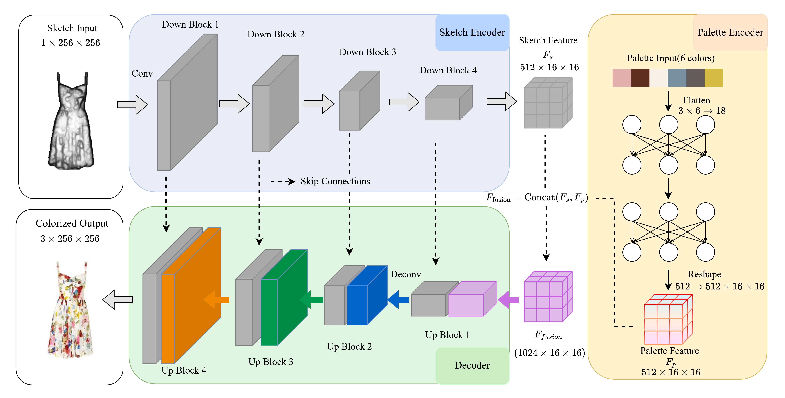

# PaletteGAN

PaletteGAN: A palette-guided fashion sketch coloring project.



This repository contains the code for **"PaletteGAN: Palette-Guided Fashion Sketch Coloring"**.

## Dependencies

This project requires Python 3 and the following dependencies:

```bash
pip install torch torchvision numpy pillow matplotlib
```

## Downloading Model

This project uses the VGG16 pretrained model to compute perceptual loss and style loss.

Please place the VGG16 model file in the project directory and modify the model path in `palettegan.py`:

```python
vgg_weights_path = "./vgg16-397923af.pth"
```

## Dataset

The fashion dataset used in this project is from the Cleaned Maryland Dataset:

https://github.com/AemikaChow/AiDLab-fAshIon-Data/blob/main/Datasets/cleaned-maryland.md

This dataset is cleaned and organized based on the Maryland PolyVore dataset. It is reclassified into 20 fashion categories, including Tops, Skirts, Pants, Outwear, Dresses, Jumpsuits, Shoes, Bags, etc. The dataset page also provides related papers that should be cited for academic use.

In this project, the dataset is processed and organized in the following format:

```text
dataset/
├── line_drawing_dc_hed_contour/
├── color_palette/
└── groundtruth/
```

## Execute

Run the training script:

```bash
python palettegan.py
```

You can select different ablation experiments by modifying `SELECTED_ABLATION_ID` in `palettegan.py`:

```python
SELECTED_ABLATION_ID = 0
```

## Testing

You can use `model_visualization.ipynb` to load the trained generator model and visualize the coloring results.

## Results

The training results will be saved in:

```text
ablation_experiments/
```

Including model checkpoints, generated images, and loss curves.
